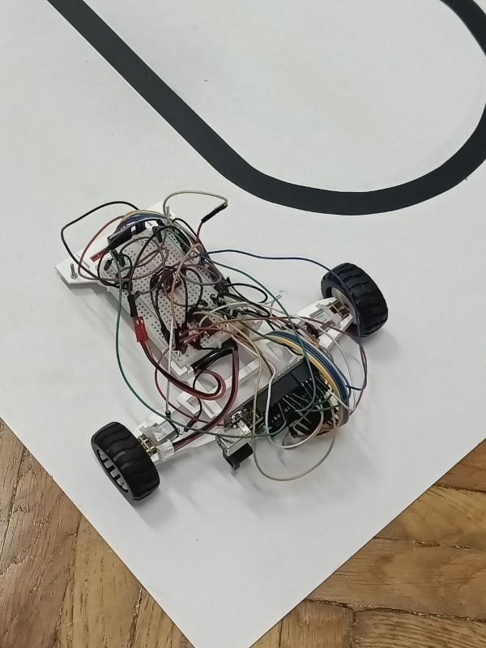
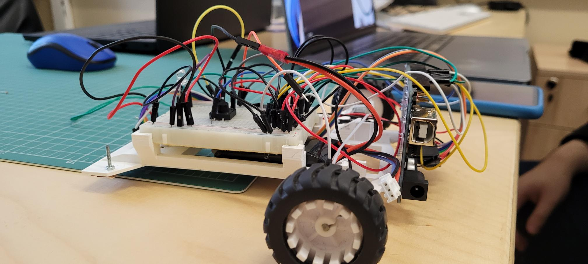

# Line Follower project

## Description

Project created as part of the "Introduction to Robotics" course during the 3rd year at the Faculty of Mathematics and Computer Science, University of Bucharest. The goal was to create a "car"-like robot to follow a black line on a white board. Its purpose was to follow the line as fast as possible without deviating from it or changing the route on curves (at best finishing the line in less than 20s, at worst finishing it in less than 35s). Our robot was close to the 20s mark (around 21s).

We build the "car"-like robot at the laboratory.
We participated in the organized hackathon alongside other students to see who can build the best robot. At the hackaton we made the robot auto-calibrate himself. After that we met the following week to adjust its values.

When making the PID we focused on the P and D parts. We also added different functionalities based on the problems we were facing (robot going too fast in a particular segment of the line; robot going too slow or stopping entirely). We adjusted the values based on the observations made from a few runs.

Our team name was Tindra. My teammate repository can be found [here](https://github.com/george-radu-cs/arduino-line-follower).

## Components used 

Arduino Uno - 1\
Chassis - 1\
A power source (LiPo battery) - 1\
QTR-8A reflectance sensor (6 sensors were used) - 1\
Screws - 2\
Ball caster (insted of front wheels) - 1\
Small breadboard - 1\
L293D motor driver - 1\
DC motors - 2\
Zip ties - 4\
Wheels - 2 (paced in the back, it's RWD)\
White LED - 1\
Wires - a lot

## Pictures of the setup
Picture 1:

Picture 2:

[Video where it follows a complex line](https://youtu.be/PQt3r07lQ-o)
